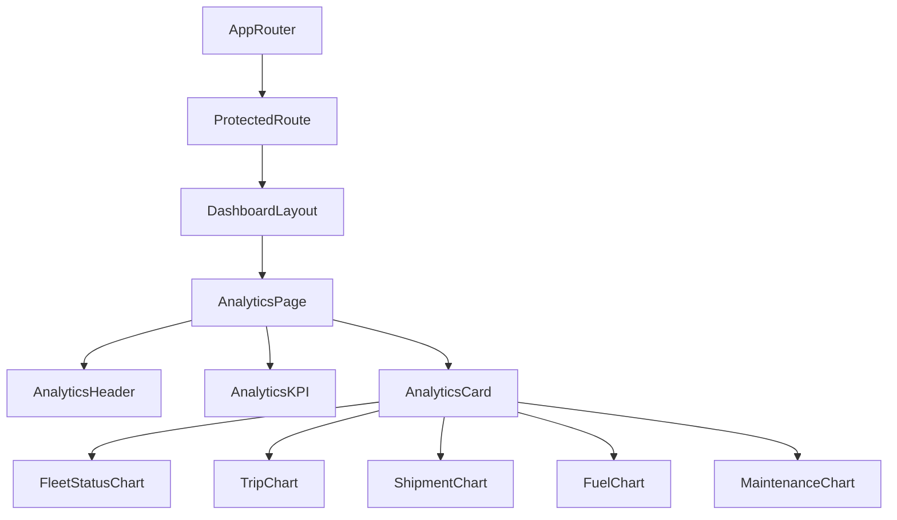

# Fleet Analytics Dashboard Documentation (SPEC-096)

This document provides a comprehensive guide to the frontend architecture and implementation of the **Executive Analytics Dashboard** in the FleetCore platform.

---

## 🏗️ Architecture & Component Tree

The analytics dashboard fits inside the authenticated dashboard wrapper `DashboardLayout`.

### Component Tree

---

## 🗃️ State Management & Data Flow

Executive analytics data queries are managed by TanStack Query for cache consistency and automatic invalidation.

- **Query Cache (`['analyticsDashboardOverview']`)**: Stores the data retrieved from `GET /api/v1/dashboard`.
- **Reusable Chart Modules**: Recharts controls with responsive dimensions and high-density, dynamic styling.

---

## 🔌 API Integration

Uses endpoints mounted at `/api/v1/dashboard` mapped via the central axios client.

| HTTP Method | API Endpoint | Description |
| :--- | :--- | :--- |
| **GET** | `/api/v1/dashboard` | Fetch aggregated dashboard metrics and overview parameters |

---

## 🎨 Accessibility & Responsiveness

- **Responsive View**: Employs responsive grid columns and flex row parameters for smooth readability on mobile, tablet, and desktop screens.
- **Accessibility features**: WAI-ARIA labels, native keyboard support, high color contrast, and tooltips.
