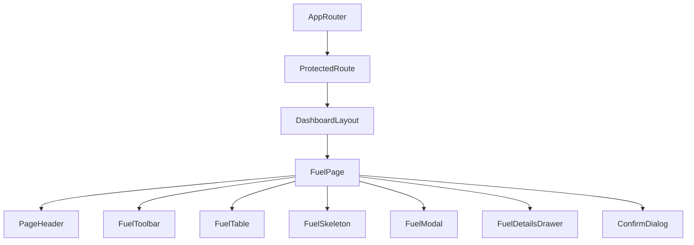

# Fuel Management Page Documentation (SPEC-092)

This document provides a comprehensive guide to the frontend architecture and implementation of the **Fuel Management Page** in the FleetCore platform.

---

## 🏗️ Architecture & Component Tree

The fuel management module integrates inside the authenticated parent wrapper `DashboardLayout`.

### Component Tree

---

## 🗃️ State Management & Data Flow

Data queries and mutations are managed by TanStack Query for cache consistency and automatic invalidation.

- **Query Cache (`['fuelRecords', ...]`)**: Stores the paginated list of refueling records.
- **Controlled Filter States**: Supports real-time local search, vehicle filter selection, and trip filter selection.
- **Relational Dropdown Selects**: Pre-fetches vehicle assets and trip dispatches to populate dropdown selectors.

---

## 🔌 API Integration

Uses endpoints mounted at `/api/v1/fuel` mapped via the central axios client.

| HTTP Method | API Endpoint | Description |
| :--- | :--- | :--- |
| **GET** | `/api/v1/fuel` | Fetch all fuel records (with search, vehicle, and trip filters) |
| **GET** | `/api/v1/fuel/:id` | Get individual refueling log details |
| **POST** | `/api/v1/fuel` | Log a new refueling purchase |
| **PUT** | `/api/v1/fuel/:id` | Modify an existing refueling purchase log |
| **DELETE** | `/api/v1/fuel/:id` | Hard delete operational fuel record |

---

## 🎨 Accessibility & Responsiveness

- **Responsive View**: Employs responsive grids and horizontal sticky table headers for smooth scrollability on mobile screens.
- **Accessibility features**: WAI-ARIA labels, native `<select>` controls for mobile form compliance, keyboard tab focus, and dialog traps.
