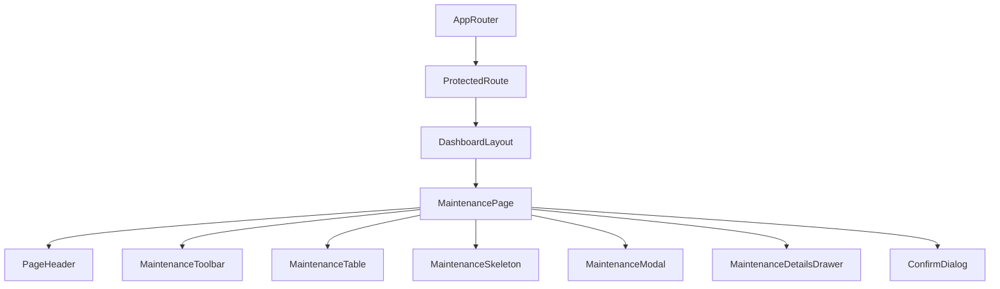

# Maintenance Management Page Documentation (SPEC-093)

This document provides a comprehensive guide to the frontend architecture and implementation of the **Maintenance Management Page** in the FleetCore platform.

---

## 🏗️ Architecture & Component Tree

The maintenance management module integrates inside the authenticated parent wrapper `DashboardLayout`.

### Component Tree

---

## 🗃️ State Management & Data Flow

Data queries and mutations are managed by TanStack Query for cache consistency and automatic invalidation.

- **Query Cache (`['maintenanceRecords', ...]`)**: Stores the paginated list of maintenance records.
- **Controlled Filter States**: Supports real-time local search, vehicle filter selection, maintenance type selection, and status selection.
- **Relational Dropdown Selects**: Pre-fetches vehicle assets and drivers list to populate dropdown selectors.

---

## 🔌 API Integration

Uses endpoints mounted at `/api/v1/maintenance` mapped via the central axios client.

| HTTP Method | API Endpoint | Description |
| :--- | :--- | :--- |
| **GET** | `/api/v1/maintenance` | Fetch all maintenance records (with search, status, type, and vehicle filters) |
| **GET** | `/api/v1/maintenance/:id` | Get individual maintenance work order details |
| **POST** | `/api/v1/maintenance` | Create a new maintenance record |
| **PUT** | `/api/v1/maintenance/:id` | Modify an existing maintenance record |
| **DELETE** | `/api/v1/maintenance/:id` | Hard delete maintenance record from history |

---

## 🎨 Accessibility & Responsiveness

- **Responsive View**: Employs responsive grids and horizontal sticky table headers for smooth scrollability on mobile screens.
- **Accessibility features**: WAI-ARIA labels, native `<select>` controls for mobile form compliance, keyboard tab focus, and dialog traps.
