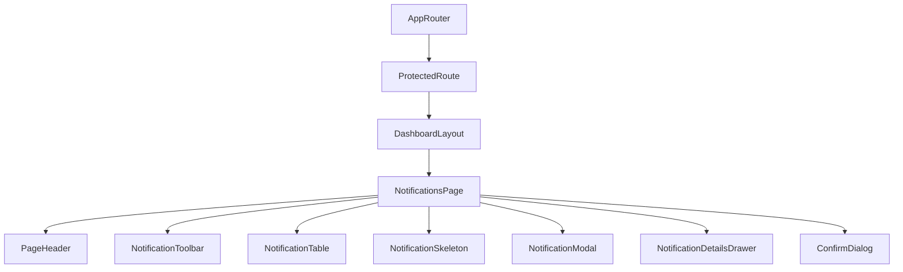

# Notifications Management Page Documentation (SPEC-095)

This document provides a comprehensive guide to the frontend architecture and implementation of the **Notifications Management Page** in the FleetCore platform.

---

## 🏗️ Architecture & Component Tree

The notifications management page fits inside the authenticated dashboard wrapper `DashboardLayout`.

### Component Tree

---

## 🗃️ State Management & Data Flow

Data queries and mutations are managed by TanStack Query for cache consistency and automatic invalidation.

- **Query Cache (`['notifications', ...]`)**: Stores the paginated list of notification records.
- **Controlled Filter States**: Supports real-time local search, recipient user filter selection, notification type filter selection, notification priority filter selection, and read status filter selection.
- **Relational Dropdown Selects**: Pre-fetches the list of drivers (which includes nested user records) and combines it with the current authenticated user's profile to populate available recipient selections dynamically.

---

## 🔌 API Integration

Uses endpoints mounted at `/api/v1/notifications` mapped via the central axios client.

| HTTP Method | API Endpoint | Description |
| :--- | :--- | :--- |
| **GET** | `/api/v1/notifications` | Fetch paginated notifications (with search, user, type, priority, and status filters) |
| **GET** | `/api/v1/notifications/:id` | Get individual notification details |
| **POST** | `/api/v1/notifications` | Create a new notification alert entry |
| **PUT** | `/api/v1/notifications/:id` | Update an existing notification log |
| **DELETE** | `/api/v1/notifications/:id` | Hard delete notification record from history |

---

## 🗂️ Metadata Viewer

Within the `NotificationDetailsDrawer` component, a responsive JSON Metadata inspector is integrated:
- Renders a styled code block when a valid JSON object is present under the `metadata` property.
- Standardizes styling with dark-themed syntax highlight layout.
- Safeguards parsing via try/catch block formatting.

---

## 🎨 Accessibility & Responsiveness

- **Responsive View**: Employs responsive grids and horizontal sticky table headers for smooth scrollability on mobile screens.
- **Accessibility features**: WAI-ARIA labels, native `<select>` controls for mobile form compliance, keyboard tab focus, and dialog traps.
