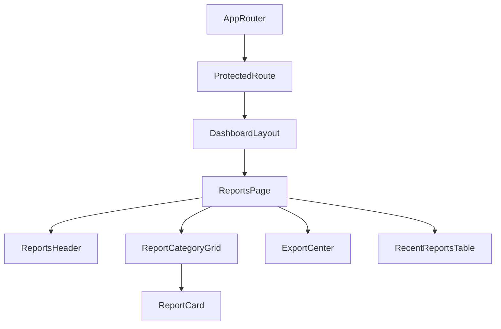

# Reports Dashboard Documentation (SPEC-097)

This document provides a comprehensive guide to the frontend architecture and implementation of the **Reports Dashboard** in the FleetCore platform.

---

## 🏗️ Architecture & Component Tree

The reports dashboard fits inside the authenticated dashboard wrapper `DashboardLayout`.

### Component Tree

---

## 🗃️ State Management & Data Flow

Operational data is formatted for export using the design layouts:
- **Category Download Grid**: Provides individual templates matching operational modules (Fleet, Drivers, Shipments, Trips, Fuel, Maintenance, GPS Tracking, Customers).
- **Consolidated Export formats**: Integrates PDF, Excel, CSV, and JSON download configuration layouts.
- **EmptyState integration**: Utilizes EmptyStates for recent log tables and coming soon notifications.

---

## 🔌 API Integration

Uses endpoints mounted at `/api/v1` mapped via the central axios client.

| HTTP Method | API Endpoint | Description |
| :--- | :--- | :--- |
| **GET** | `/api/v1/dashboard` | Fetch aggregated dashboard metrics and overview parameters |

---

## 🎨 Accessibility & Responsiveness

- **Responsive View**: Employs responsive grid columns and flex row parameters for smooth readability on mobile, tablet, and desktop screens.
- **Accessibility features**: WAI-ARIA labels, native keyboard support, and high color contrast.
