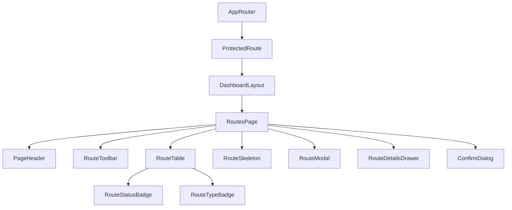

# Routes Management Page Documentation (SPEC-090)

This document provides a comprehensive guide to the frontend architecture and implementation of the **Routes Management Page** in the FleetCore platform.

---

## 🏗️ Architecture & Component Tree

The routes management layout is mounted inside the authenticated `DashboardLayout`.

### Component Tree

---

## 🗃️ State Management & Data Flow

State management utilizes TanStack Query for caching and invalidation, providing clean pagination, search, and filters.

- **Query Cache (`['routes', ...]`)**: Stores the paginated and filtered routes listing.
- **Local Reactive Filters**: Manages `search`, `status`, `routeType`, `page`, `sortBy`, and `sortOrder`.
- **Form Auto-Generation**: Automatically populates `name` (e.g. `Austin to Houston`) as `origin` and `destination` values change in the `RouteModal`, unless custom-edited.

---

## 🔌 API Integration

All endpoints consume `/api/v1/routes` using the central axios-based `apiClient`.

| HTTP Method | API Endpoint | Description |
| :--- | :--- | :--- |
| **GET** | `/api/v1/routes` | Fetch routes (with search, category, status filters, and sorting) |
| **GET** | `/api/v1/routes/:id` | Retrieve single route corridor details |
| **POST** | `/api/v1/routes` | Create new routing corridor |
| **PUT** | `/api/v1/routes/:id` | Update route corridor details |
| **DELETE** | `/api/v1/routes/:id` | Hard delete planned route |

---

## 🎨 Accessibility & Responsiveness

- **Responsiveness**: Re-flows from large grid cards down to single-column detail list overlays on mobile devices.
- **Semantic HTML**: Fully annotated table structure, headers, and action icons.
- **WAI-ARIA Controls**: Standard modal traps, drawer slide focus locks, and readable screen reader labels.
