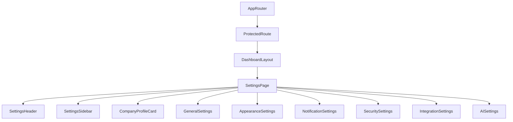

# Settings & Company Profile Documentation (SPEC-098)

This document provides a comprehensive guide to the frontend architecture and implementation of the **Settings & Company Profile** dashboard in the FleetCore platform.

---

## 🏗️ Architecture & Component Tree

The settings page fits inside the authenticated dashboard wrapper `DashboardLayout`.

### Component Tree

---

## 🗃️ Settings State & Persistence

- **Appearance Preferences**: Options for Theme (Light, Dark, System) and Brand Accent Color (Fleet Orange, Ocean Blue) are updated reactively on `document.documentElement` class layers and persisted to the browser's `localStorage` state.
- **EmptyState Fallback integration**: Modules without active backend controllers render `EmptyState` boxes indicating feature availability.

---

## 🔌 API Integration

Uses endpoints mounted at `/api/v1` mapped via the central axios client.

| HTTP Method | API Endpoint | Description |
| :--- | :--- | :--- |
| **GET** | `/api/v1/dashboard` | Fetch aggregated dashboard metrics and overview parameters |

---

## 🎨 Accessibility & Responsiveness

- **Responsive Sidebar**: Transitions from flex row column selectors on small screens to standard vertical menus on wider viewports.
- **Accessibility features**: WAI-ARIA controls, keyboard index controls, and high text contrast.
