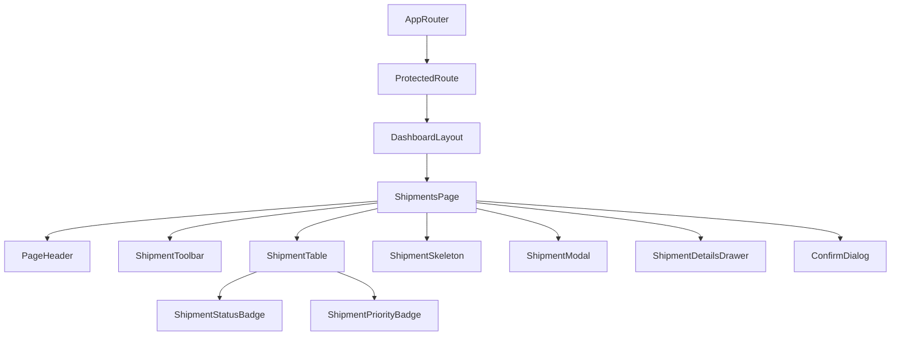

# Shipments Management Page Documentation (SPEC-089)

This document provides a comprehensive guide to the frontend architecture and implementation of the **Shipments Management Page** in the FleetCore platform.

---

## 🏗️ Architecture & Component Tree

The page uses a modular, component-driven design layout integrated into the secure, authenticated `DashboardLayout`.

### Component Tree

---

## 🗃️ State Management & Data Flow

State management follows the established TanStack Query pattern, keeping client components lightweight and synchronization-focused.

- **Query Cache (`['shipments', ...]`)**: Stores server-state shipment listings. Cache invalidates automatically on successful mutations (create, update, or delete).
- **Query Cache (`['customers-list-all']`)**: Pre-fetches customer company profiles for dropdown selectors.
- **Local Filter State**: Maintains reactive variables for `search`, `status`, `priority`, and `customerId` queries.

---

## 🔌 API Integration

All transactions use the RESTful `apiClient` mapping to the backend shipment router:

| HTTP Method | API Endpoint | Description |
| :--- | :--- | :--- |
| **GET** | `/api/v1/shipments` | Fetch paginated list of shipments (with optional search, customer, priority, and status filters) |
| **GET** | `/api/v1/shipments/:id` | Retrieve detailed profile for a single shipment |
| **POST** | `/api/v1/shipments` | Record a new shipment profile |
| **PUT** | `/api/v1/shipments/:id` | Update an existing shipment profile |
| **DELETE** | `/api/v1/shipments/:id` | Hard delete shipment record |

### Page Query Lifecycle
1. The user navigates to `/shipments`.
2. `ShipmentsPage` mounts, initiating the `useQuery` call.
3. The page renders the `ShipmentSkeleton` during loading.
4. On success, `ShipmentTable` presents data with sorting, responsive columns, and actions.
5. On failure, `ErrorState` handles retry triggers.

---

## 🎨 Design & Theme Alignment

The interface adheres to the FleetCore design system, emphasizing clean hierarchy and consistent layout dimensions:

- **Typography**: Inter / Outfit fonts.
- **Color Palette**: Deep Navy card headers, FleetCore Orange active buttons, priority status tags, and cool-gray backdrop shadows.
- **Micro-Animations**: Uses `animate-scale-up` for modal dialogues, `animate-slide-in` for the side drawer, and subtle opacity transitions for table action rows.
- **Accessibility**: Includes proper ARIA tags, descriptive keyboard navigation cues, and distinct contrast focus rings.
