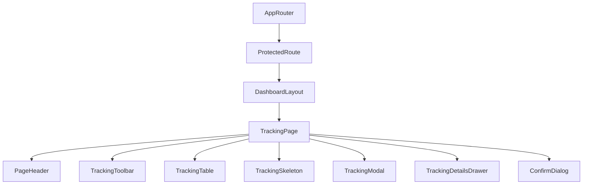

# GPS Tracking Management Page Documentation (SPEC-094)

This document provides a comprehensive guide to the frontend architecture and implementation of the **GPS Tracking Management Page** in the FleetCore platform.

---

## 🏗️ Architecture & Component Tree

The tracking management module integrates inside the authenticated parent wrapper `DashboardLayout`.

### Component Tree

---

## 🗃️ State Management & Data Flow

Data queries and mutations are managed by TanStack Query for cache consistency and automatic invalidation.

- **Query Cache (`['trackingHistory', ...]`)**: Stores the paginated list of tracking records.
- **Controlled Filter States**: Supports real-time local search, vehicle filter selection, driver filter selection, and trip filter selection.
- **Relational Dropdown Selects**: Pre-fetches vehicle assets, drivers list, and active trips to populate dropdown selectors.

---

## 🔌 API Integration

Uses endpoints mounted at `/api/v1/tracking` mapped via the central axios client.

| HTTP Method | API Endpoint | Description |
| :--- | :--- | :--- |
| **GET** | `/api/v1/tracking` | Fetch paginated tracking records (with search, vehicle, driver, and trip filters) |
| **GET** | `/api/v1/tracking/:id` | Get individual tracking location history log details |
| **POST** | `/api/v1/tracking` | Create a new tracking location history breadcrumb entry |
| **PUT** | `/api/v1/tracking/:id` | Modify an existing tracking log record |
| **DELETE** | `/api/v1/tracking/:id` | Hard delete tracking log record from history |

---

## 🗺️ Map Preview

Within the `TrackingDetailsDrawer` component, a responsive Map Preview section is integrated.
If valid latitudinal and longitudinal coordinates are present:
- Displays an embedded **OpenStreetMap** iframe with a marker pointing to the location.
- Bounding Box (`bbox`) formula is computed dynamically using a small offset delta ($0.005$ degrees) around the target location:
  `bbox=${lon - 0.005},${lat - 0.005},${lon + 0.005},${lat + 0.005}`
- OpenStreetMap is loaded fully in HTML without requiring private Google Maps/Mapbox API tokens.

If coordinates are unavailable or invalid, shows a graceful placeholder stating coordinates are unavailable for map rendering.

---

## 🎨 Accessibility & Responsiveness

- **Responsive View**: Employs responsive grids and horizontal sticky table headers for smooth scrollability on mobile screens.
- **Accessibility features**: WAI-ARIA labels, native `<select>` controls for mobile form compliance, keyboard tab focus, and dialog traps.
