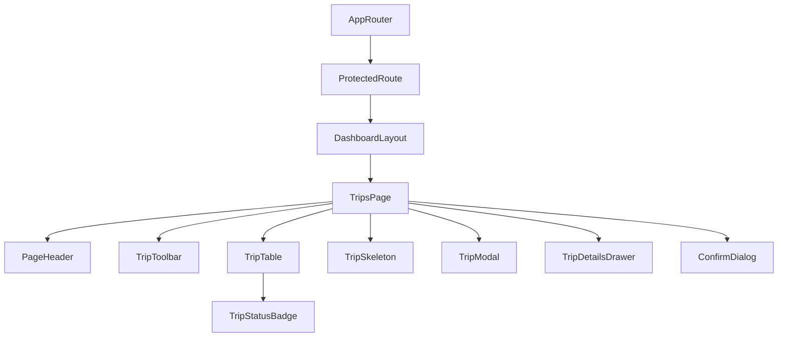

# Trips Management Page Documentation (SPEC-091)

This document provides a comprehensive guide to the frontend architecture and implementation of the **Trips Management Page** in the FleetCore platform.

---

## 🏗️ Architecture & Component Tree

The trips management module integrates inside the authenticated parent wrapper `DashboardLayout`.

### Component Tree

---

## 🗃️ State Management & Data Flow

Data queries and mutations are managed by TanStack Query for cache consistency and automatic invalidation.

- **Query Cache (`['trips', ...]`)**: Stores the paginated list of dispatched trips.
- **Controlled Filter States**: Supports real-time local search, vehicle filter selection, driver filter selection, and status filters.
- **Relational Dropdown Selects**: Pre-fetches vehicle assets, driver profiles, shipments requests, and route paths to populate dropdown selectors.

---

## 🔌 API Integration

Uses endpoints mounted at `/api/v1/trips` mapped via the central axios client.

| HTTP Method | API Endpoint | Description |
| :--- | :--- | :--- |
| **GET** | `/api/v1/trips` | Fetch all trips (with search, vehicle, driver, and status filters) |
| **GET** | `/api/v1/trips/:id` | Get individual trip dispatch details |
| **POST** | `/api/v1/trips` | Dispatch a new trip |
| **PUT** | `/api/v1/trips/:id` | Modify an existing dispatch |
| **DELETE** | `/api/v1/trips/:id` | Hard delete operational trip record |

---

## 🎨 Accessibility & Responsiveness

- **Responsive View**: Employs responsive grids and horizontal sticky table headers for smooth scrollability on mobile screens.
- **Accessibility features**: WAI-ARIA labels, native `<select>` controls for mobile form compliance, keyboard tab focus, and dialog traps.
